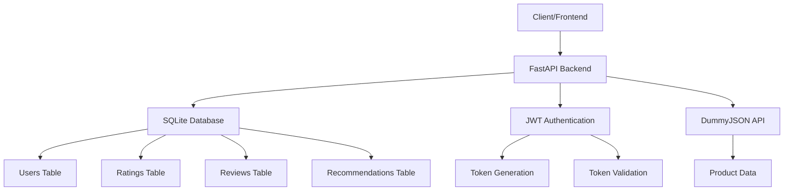
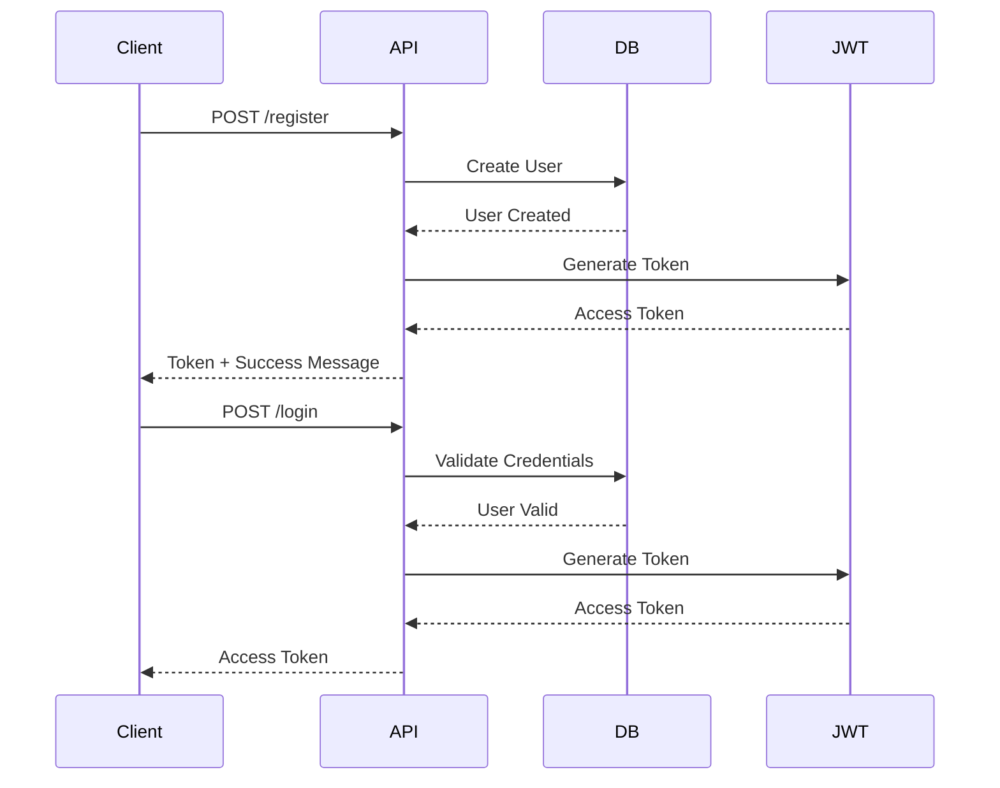
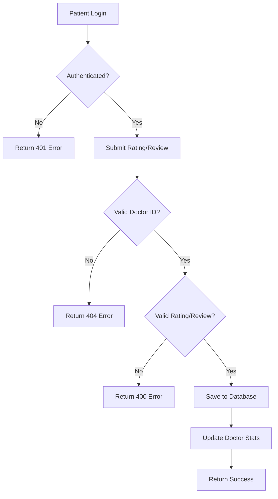
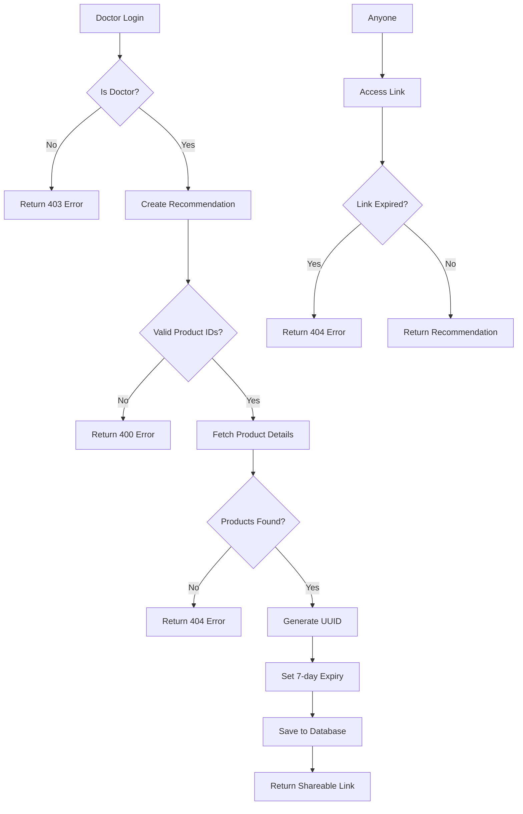

## System Architecture

```mermaid
graph TB
    A[Client/Frontend] --> B[FastAPI Backend]
    B --> C[SQLite Database]
    B --> D[JWT Authentication]
    B --> E[DummyJSON API]
    
    C --> C1[Users Table]
    C --> C2[Ratings Table]
    C --> C3[Reviews Table]
    C --> C4[Recommendations Table]
    
    D --> D1[Token Generation]
    D --> D2[Token Validation]
    
    E --> E1[Product Data]
```

## API Workflow Diagrams

### Authentication Flow

```mermaid
sequenceDiagram
    participant Client
    participant API
    participant DB
    participant JWT
    
    Client->>API: POST /register
    API->>DB: Create User
    DB-->>API: User Created
    API->>JWT: Generate Token
    JWT-->>API: Access Token
    API-->>Client: Token + Success Message
    
    Client->>API: POST /login
    API->>DB: Validate Credentials
    DB-->>API: User Valid
    API->>JWT: Generate Token
    JWT-->>API: Access Token
    API-->>Client: Access Token
```

### Rating & Review Flow

```mermaid
flowchart TD
    A[Patient Login] --> B{Authenticated?}
    B -->|No| C[Return 401 Error]
    B -->|Yes| D[Submit Rating/Review]
    D --> E{Valid Doctor ID?}
    E -->|No| F[Return 404 Error]
    E -->|Yes| G{Valid Rating/Review?}
    G -->|No| H[Return 400 Error]
    G -->|Yes| I[Save to Database]
    I --> J[Update Doctor Stats]
    J --> K[Return Success]
```

### Recommendation Creation & Sharing Flow

```mermaid
flowchart TD
    A[Doctor Login] --> B{Is Doctor?}
    B -->|No| C[Return 403 Error]
    B -->|Yes| D[Create Recommendation]
    D --> E{Valid Product IDs?}
    E -->|No| F[Return 400 Error]
    E -->|Yes| G[Fetch Product Details]
    G --> H{Products Found?}
    H -->|No| I[Return 404 Error]
    H -->|Yes| J[Generate UUID]
    J --> K[Set 7-day Expiry]
    K --> L[Save to Database]
    L --> M[Return Shareable Link]
    
    N[Anyone] --> O[Access Link]
    O --> P{Link Expired?}
    P -->|Yes| Q[Return 404 Error]
    P -->|No| R[Return Recommendation]
```
